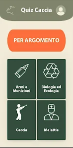
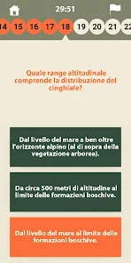
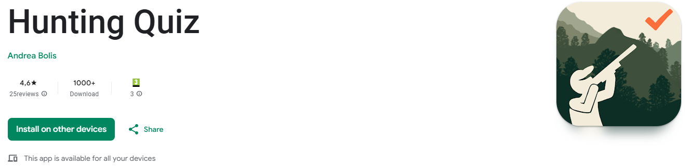

**Quiz Caccia**

**Quiz Caccia** is an app designed to help users prepare for the hunting license exam in the Lombardy and Tuscany regions. 
It includes official questions, ensuring an accurate and effective study experience.

---

📌 Features

🏆 Timed challenges to simulate real exam conditions

🎯 Official questions from the hunting license exam

📊 Scoring system to track progress and improvements

📚 Multiple categories covering all key topics

🎨 User-friendly interface for an intuitive learning experience

   

---

🚀 Installation

Download Quiz Caccia from the Google Play Store:

https://play.google.com/store/apps/details?id=org.android.myapp&hl=it
 
  

 ---
 
🛠️ Technologies Used

Python

Kivy (for UI development)

Buildzer (to compile AAB)

Figma (for UI/UX design)

   

---
 
📬 Contact

For suggestions, bug reports, or feature requests, feel free to reach out:

📧 Email: andreabolis64@gmail.com
